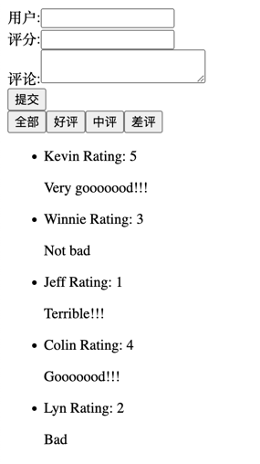

### 功能描述

实现评论填写和筛选系统，能够填写评论，能够筛选出全部评论，好评，中评，差评

### 设计图


#### AC

1. 当用户进入页面，可以看到评论筛选系统包含：评论填写输入框（包含用户名，打分，评论内容），评论筛选按钮（全部/好评/中评/差评），评论列表及其下列表项（包含用户名，打分，评论内容）
2. 用户进入系统，默认展示全部评论信息，排序都按照默认获取的数据顺序进行排序
3. 用户点击评论筛选按钮，可进行评论筛选，即点击好评按钮，评论列表只展示好评评论项；其余按钮亦是如此（0-1 分为差评，2-3 分为中评，4-5 分为好评）
4. 用户可输入用户名，评分和评论内容，新建一条评论，并在筛选条件下展示评论

### 组件树

```
CommentApp
   └──CommentInput
   └──CommentFilter
   └──CommentList
```

### 工序
1. 显示评论
    - Scenario 1 [Component]CommentList 初次渲染，默认全部
        - render CommentList 组件 with props：comments(默认值为原始数据集)和activeType（默认值为"all"）
        - 页面显示5条数据信息（包含用户名，打分，评论内容）
2. 筛选评论
    - Scenario 2 [Component]CommentFilter 初次渲染，包括全部/好评/中评/差评四个按钮
        - 页面显示四个按钮
    - Scenario 3 [Component]点击好评按钮，修改activeType
        - 触发"好评"按钮 click 事件
        - 修改activeType
        - CommentList根据comments, activeType重新渲染
3. 添加评论
    - Scenario 4 [Component]CommentInput 初次渲染，包含用户名，打分，评论内容三个输入框及提交按钮
        - 页面显示三个输入框及一个按钮
    - Scenario 5 [Component]点击提交按钮，修改comments
        - 触发"提交"按钮 click 事件, 并清空输入框中内容
        - 修改comments
        - CommentList根据comments, activeType重新渲染

### 要求
   - 小步提交，提交信息清晰
   - AC全部完成